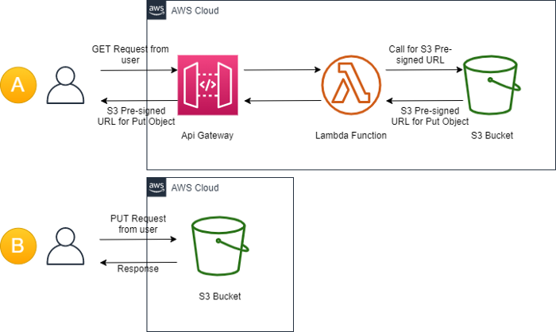

# How to Upload a Binary File to Amazon S3 Bucket using Pre-Signed URL

## Architecture

First part of architecture A in the API Gateway will receive GET request from the user, GET method of API Gateway is integrated with lambda function, so API Gateway will pass that GET Request to Lambda function and Lambda function will call the S3 Bucket using method of AWS SDK(i.e. In JavaScript SDK(NodeJS), using getSignedUrl() or getSignedUrlPromise()). and lambda will send back response with S3 Pre-SignedUrl to API Gateway and API Gateway to User.

Second part of architecture B, once application got Pre-signedUrl then application can perform PUT request on that URL to upload binary file before expiry of pre-signedurl.

---
### For the `Pre-requisites`, `Implementation` and `Clean` visit the below my blog post:

https://aws.plainenglish.io/how-you-can-upload-binary-file-to-amazon-s3-bucket-via-api-gateway-f12c11d2b365